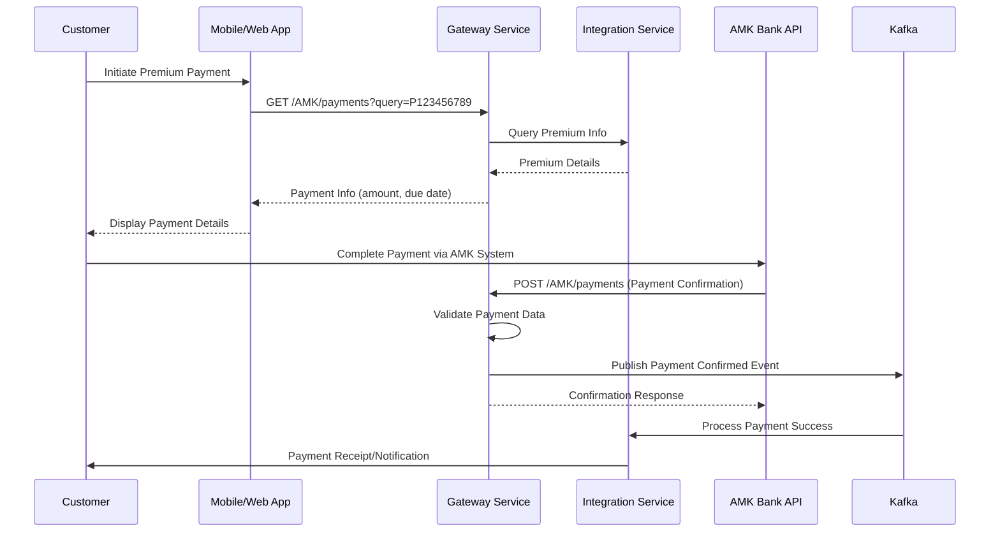
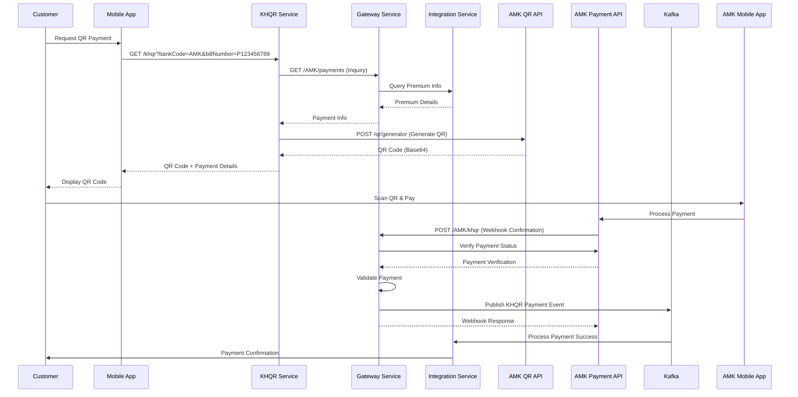
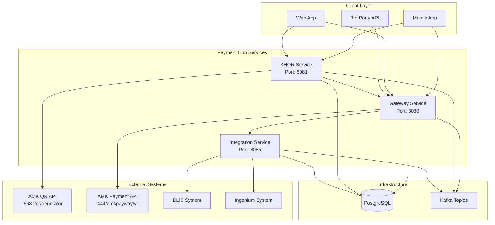
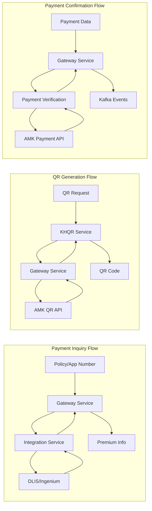

# AMK Payment Integration API Specification
**Version:** 1.0  
**Date:** October 7, 2025  
**Bank Partner:** AMK (Angkor Mikroheranhvatho Kampuchea Co., Ltd)

## Table of Contents
1. [Overview](#overview)
2. [High-Level API Flow](#high-level-api-flow)
3. [Authentication](#authentication)
4. [Bill Payment Integration](#bill-payment-integration)
5. [KHQR Payment Integration](#khqr-payment-integration)
6. [Error Handling](#error-handling)
7. [Data Models](#data-models)
8. [Environment Configuration](#environment-configuration)

## Overview

The AMK Payment Integration API provides two main payment methods for Dai-Ichi Life Cambodia customers:
1. **Bill Payment** - Traditional payment processing for insurance premiums
2. **KHQR Payment** - QR code-based payment system for mobile payments

### System Architecture
- **Gateway Service**: Handles payment processing and verification
- **KHQR Service**: Manages QR code generation and payment confirmation
- **Integration Service**: Manages policy and premium inquiries

### Base URLs
- **Gateway Service**: `http://localhost:8080/AMK`
- **KHQR Service**: `http://localhost:8081/khqr`
- **AMK Partner API**: `http://10.116.17.153:8687`

## High-Level API Flow

### Bill Payment Flow



### KHQR Payment Flow



### System Architecture Overview



### Data Flow Architecture



### API Interaction Patterns

#### 1. Synchronous API Calls
- **Client → Gateway**: Real-time payment inquiry and confirmation
- **Gateway → Integration**: Premium data retrieval
- **KHQR → AMK**: QR code generation
- **Gateway → AMK**: Payment verification

#### 2. Asynchronous Event Processing
- **Payment Confirmed**: Triggers downstream processing
- **KHQR Generated**: Audit and analytics
- **Payment Verified**: Policy update workflows

#### 3. Webhook Integration
- **AMK → Gateway**: Real-time payment notifications
- **Retry Logic**: Automatic retry on webhook failures
- **Idempotency**: Duplicate payment prevention

### Key Integration Points

1. **Authentication Flow**
   ```
   Client → JWT Token → Gateway Service
   Gateway → OAuth2 → AMK Partner API
   KHQR Service → Bearer Token → AMK QR API
   ```

2. **Data Validation**
   ```
   Input Validation → Business Rules → Partner API Validation
   ```

3. **Error Handling**
   ```
   Client Error → Gateway Error → Partner Error → Fallback
   ```

4. **Event Processing**
   ```
   Payment Action → Kafka Event → Downstream Services → Customer Notification
   ```

### Performance Considerations

- **Caching**: Premium data cached for 15 minutes
- **Rate Limiting**: 100 requests/minute per client
- **Circuit Breaker**: Auto-failover when AMK API unavailable
- **Async Processing**: Non-blocking payment confirmations
- **Database Pooling**: Connection pool size: 20 connections
- **Kafka Partitioning**: Events partitioned by policy number

### API Endpoints Summary

| Service | Method | Endpoint | Purpose | Authentication |
|---------|--------|----------|---------|----------------|
| Gateway | GET | `/AMK/payments` | Premium inquiry | Bearer Token |
| Gateway | POST | `/AMK/payments` | Bill payment confirmation | Bearer Token |
| Gateway | POST | `/AMK/khqr` | KHQR payment webhook | Bearer Token |
| KHQR | GET | `/khqr` | Generate QR code | Bearer Token |
| AMK Partner | POST | `/auth/sign-in` | Authentication | Username/Password |
| AMK Partner | POST | `/qr/generator` | QR generation | Bearer Token |
| AMK Partner | POST | `/amkpayway/v1/api/payment/payment-verify` | Payment verification | HMAC-SHA512 |

### Integration Checklist

#### Pre-Integration Setup
- [ ] Configure AMK merchant accounts
- [ ] Set up authentication credentials
- [ ] Configure HMAC signature keys
- [ ] Test network connectivity to AMK APIs
- [ ] Set up Kafka topics and consumers

#### Bill Payment Integration
- [ ] Implement payment inquiry endpoint
- [ ] Implement payment confirmation endpoint
- [ ] Set up payment verification with AMK
- [ ] Configure webhook endpoints
- [ ] Test end-to-end payment flow

#### KHQR Payment Integration
- [ ] Implement QR code generation
- [ ] Set up KHQR webhook handling
- [ ] Configure payment verification
- [ ] Test QR scanning and payment
- [ ] Validate callback processing

#### Monitoring & Alerting
- [ ] Set up API monitoring dashboards
- [ ] Configure payment failure alerts
- [ ] Monitor AMK API response times
- [ ] Track payment success rates
- [ ] Set up Kafka lag monitoring

## Authentication

### AMK Integration Authentication
```http
POST http://10.116.17.153:8687/auth/sign-in
Content-Type: application/json

{
  "username": "BanhJiQRGenerateKH",
  "password": "AmkP@ssword"
}
```

**Response:**
```json
{
  "access_token": "eyJhbGciOiJIUzI1NiIsInR5cCI6IkpXVCJ9...",
  "token_type": "Bearer",
  "expires_in": 3600
}
```

## Bill Payment Integration

### 1. Payment Inquiry

Retrieve premium information for a policy or application number.

**Endpoint:** `GET /AMK/payments`

**Parameters:**
- `query` (string, required): Policy number or application number (max 10 characters, alphanumeric only)

**Request:**
```http
GET /AMK/payments?query=P123456789
Authorization: Bearer {jwt_token}
```

**Response:**
```json
{
  "success": true,
  "data": {
    "id": 150001,
    "policyNumber": "P123456789",
    "payer": "John Doe",
    "amount": 150.00,
    "currency": "USD",
    "dueDate": "2025-11-15"
  }
}
```

### 2. Payment Confirmation

Confirm a bill payment transaction.

**Endpoint:** `POST /AMK/payments`

**Request:**
```json
{
  "id": 150001,
  "policyNumber": "P123456789",
  "amount": 150.00,
  "currency": "USD",
  "bankTransactionId": "AMK202510070001",
  "payer": "John Doe",
  "paidDate": "20251007120000"
}
```

**Response:**
```json
{
  "success": true,
  "data": {
    "transactionId": "AMK202510070001",
    "paymentReferenceId": "150001",
    "status": "CONFIRMED",
    "message": "Payment successfully processed"
  }
}
```

## KHQR Payment Integration

### 1. QR Code Generation

Generate a KHQR (Khmer QR) code for payment.

**Endpoint:** `GET /khqr`

**Parameters:**
- `bankCode` (object, required): Bank code information
- `billNumber` (string, required): Policy or application number

**Request:**
```http
GET /khqr?bankCode={"id":"AMK","bank":"AMK"}&billNumber=P123456789
Authorization: Bearer {jwt_token}
```

**Response:**
```json
{
  "success": true,
  "data": {
    "paymentId": 150001,
    "policyId": "P123456789",
    "customerName": "John Doe",
    "amount": 150.00,
    "currency": "USD",
    "qrCode": "iVBORw0KGgoAAAANSUhEUgAAA..."
  }
}
```

### 2. KHQR Payment Confirmation

Confirm a KHQR payment transaction (webhook from AMK).

**Endpoint:** `POST /AMK/khqr`

**Request:**
```json
{
  "invoice_number": "150001",
  "status": "SUCCESS",
  "merchant_number": "900000000290002",
  "paid_amount": 150.00,
  "currency": "USD",
  "paid_datetime": "2025-10-07 12:00:00.123456"
}
```

**Response:**
```json
{
  "success": true,
  "data": {
    "transactionId": "AMK_KHQR_150001",
    "status": "CONFIRMED",
    "message": "KHQR payment successfully processed"
  }
}
```

### 3. Payment Verification

Verify payment status with AMK partner system.

**Internal Process:**
- Merchant ID: `900000000290002`
- Store ID: `800000000270001`
- Terminal ID: `70000002`
- Uses HMAC-SHA512 signature verification

**Verification Request to AMK:**
```http
POST https://mms-uat.amkcambodia.com:444/amkpayway/v1/api/payment/payment-verify
Content-Type: application/x-www-form-urlencoded

merchantId=900000000290002&storeId=800000000270001&terminalId=70000002&txId=150001&timestamp=1696665600000&hash={hmac_signature}
```

## Error Handling

### Standard Error Response
```json
{
  "success": false,
  "error": {
    "code": "RESOURCE_NOT_FOUND",
    "message": "Policy not found",
    "details": "Query: P123456789"
  }
}
```

### Common Error Codes
- `RESOURCE_NOT_FOUND`: Policy or payment not found
- `BAD_REQUEST`: Invalid request parameters
- `PAYMENT_VERIFICATION_DATA_MISMATCHED`: Payment verification failed
- `BANK_NOT_FOUND`: Bank configuration not found
- `MERCHANT_NOT_BIND`: Merchant account not configured
- `TRANSACTION_VERIFY_FAILED`: Payment verification with AMK failed
- `AMK_UNKNOWN_ERROR`: Unknown error from AMK system
- `SERVER_UNAVAILABLE`: AMK service unavailable

## Data Models

### AmkPaymentInquiryResDto
```json
{
  "id": "Long",
  "policyNumber": "String",
  "payer": "String", 
  "amount": "BigDecimal",
  "currency": "CurrencyVo (USD/KHR)",
  "dueDate": "LocalDate (YYYY-MM-dd)"
}
```

### AmkPaymentConfirmationReqDto
```json
{
  "id": "Long (required)",
  "policyNumber": "String (9-10 chars, required)",
  "amount": "BigDecimal (positive, required)",
  "currency": "CurrencyVo (required)",
  "bankTransactionId": "String (required)",
  "payer": "String (required)",
  "paidDate": "Date (yyyyMMddHHmmss, GMT+7, required)"
}
```

### AmkKhqrConfirmationReqDto
```json
{
  "invoice_number": "String",
  "status": "String",
  "merchant_number": "String",
  "paid_amount": "BigDecimal",
  "currency": "CurrencyVo",
  "paid_datetime": "Date (yyyy-MM-dd HH:mm:ss.SSSSSS, Asia/Bangkok)"
}
```

### GenerateKhqrReqDto
```json
{
  "bankCode": {
    "id": "String (required)",
    "bank": "String (required)"
  },
  "billNumber": "String (required)"
}
```

### GenerateKhqrResDto
```json
{
  "paymentId": "Long",
  "policyId": "String",
  "customerName": "String",
  "amount": "BigDecimal",
  "currency": "CurrencyVo",
  "qrCode": "String (Base64 encoded image)"
}
```

## Environment Configuration

### Gateway Service Configuration
```yaml
integration:
  amk-integration:
    base_url: http://10.116.17.153:8687
    verify-payment-url: https://mms-uat.amkcambodia.com:444/amkpayway/v1/api/payment/payment-verify
    merchant-id: 900000000290002
    store-id: 800000000270001
    terminal-id: 70000002
    secret-key: b9QhLjN/I/TI4UmTEQqidPJQI9ryO0gLSMalOMQ9wg5Yi7eLbp4bQ47xqC+Cu0FBkQcpLVvrDresPzFLWkkgtQ==
    auth:
      endpoint: /auth/sign-in
      username: BanhJiQRGenerateKH
      password: AmkP@ssword
```

### KHQR Service Configuration
```yaml
integration:
  gateway:
    base_url: http://localhost:8080
    access-token: {jwt_token}
    amk:
      inquiry: /AMK/payments
  amk-integration:
    base_url: http://10.116.17.153:8687
    currency: USD
    auth:
      endpoint: /auth/sign-in
      username: BanhJiQRGenerateKH
      password: AmkP@ssword
```

### Kafka Topics
```yaml
kafka-event-topic:
  gateway:
    payment:
      confirmed: dev.gateway.payment.confirmed
      verified: dev.gateway.payment.verified
      success: dev.gateway.payment.success
  khqr:
    generated-event: dev.khqr.generated-event
```

## Security Considerations

1. **Authentication**: All API calls require Bearer token authentication
2. **Request Validation**: Input validation using Jakarta Bean Validation
3. **HMAC Signature**: KHQR payment verification uses HMAC-SHA512 signatures
4. **TLS/SSL**: All external communications use HTTPS
5. **Data Encryption**: Sensitive configuration data is encrypted

## Integration Flow

### Bill Payment Flow
1. Customer initiates payment inquiry → `GET /AMK/payments`
2. System retrieves premium information from Integration Service
3. Customer completes payment through AMK system
4. AMK sends payment confirmation → `POST /AMK/payments`
5. System verifies payment and updates records
6. Kafka event published for downstream processing

### KHQR Payment Flow
1. Customer requests QR code → `GET /khqr`
2. System generates QR code via AMK integration
3. Customer scans QR and pays through mobile app
4. AMK sends webhook confirmation → `POST /AMK/khqr`
5. System verifies payment with AMK partner API
6. Payment confirmed and Kafka event published

This specification provides comprehensive coverage of the AMK integration for both bill payment and KHQR payment methods, including all necessary technical details for implementation and testing.