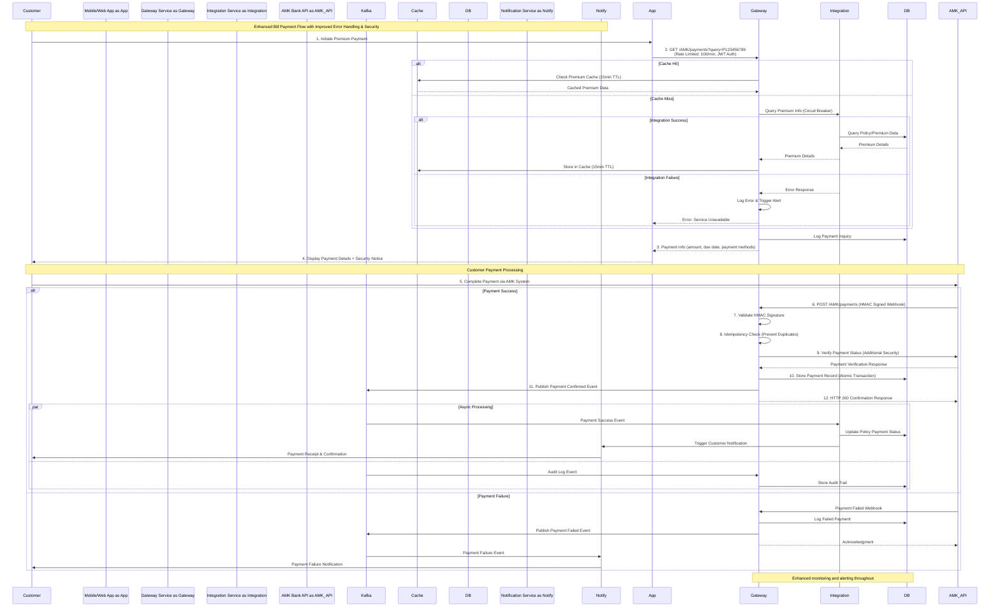
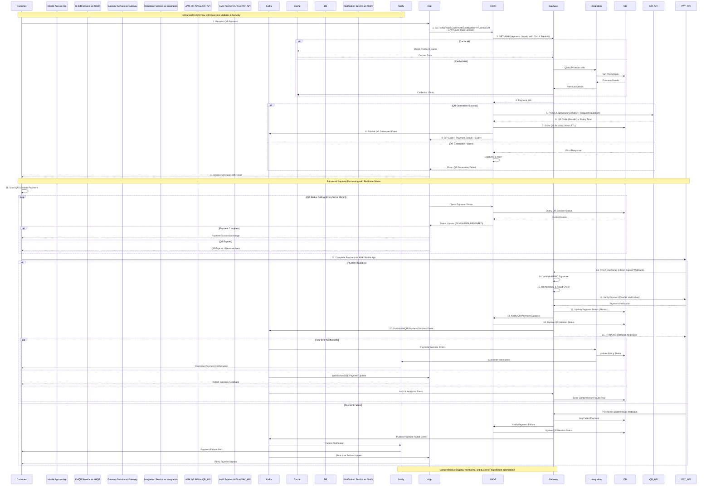
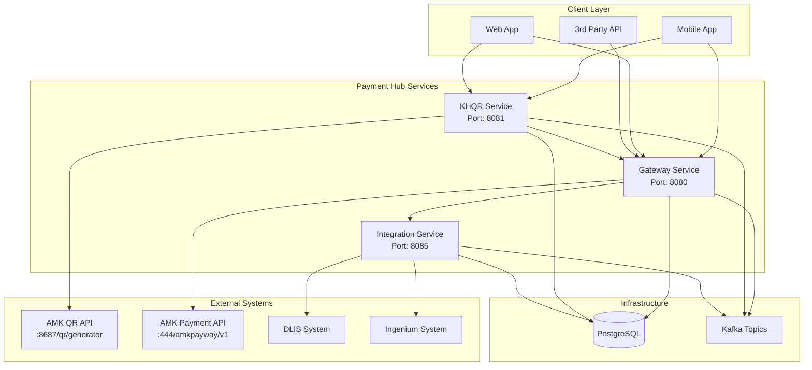
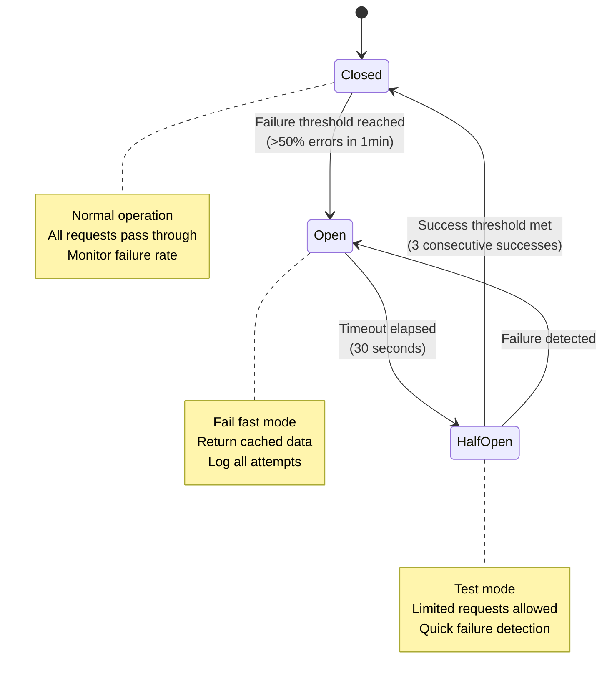
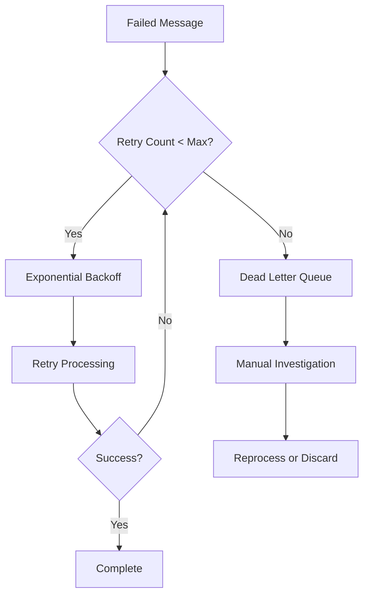
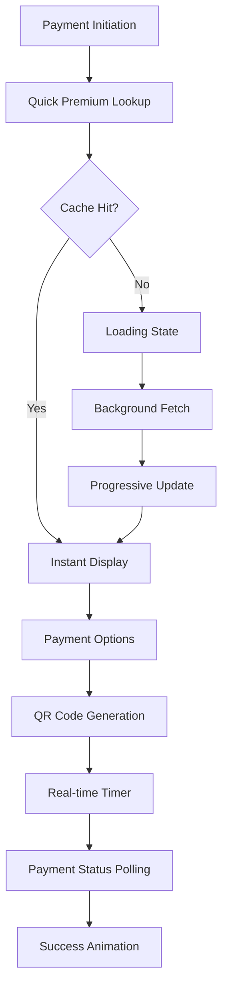

# AMK Payment Integration API Specification
**Version:** 1.0  
**Date:** October 7, 2025  
**Bank Partner:** AMK (Angkor Mikroheranhvatho Kampuchea Co., Ltd)

## Table of Contents
1. [Overview](#overview)
2. [High-Level API Flow](#high-level-api-flow)
3. [Authentication](#authentication)
4. [Bill Payment Integration](#bill-payment-integration)
5. [KHQR Payment Integration](#khqr-payment-integration)
6. [Error Handling](#error-handling)
7. [Data Models](#data-models)
8. [Environment Configuration](#environment-configuration)

## Overview

The AMK Payment Integration API provides two main payment methods for Dai-Ichi Life Cambodia customers:
1. **Bill Payment** - Traditional payment processing for insurance premiums
2. **KHQR Payment** - QR code-based payment system for mobile payments

### System Architecture
- **Gateway Service**: Handles payment processing and verification
- **KHQR Service**: Manages QR code generation and payment confirmation
- **Integration Service**: Manages policy and premium inquiries

### Base URLs
- **Gateway Service**: `http://localhost:8080/AMK`
- **KHQR Service**: `http://localhost:8081/khqr`
- **AMK Partner API**: `http://10.116.17.153:8687`

## High-Level API Flow

### Enhanced Bill Payment Flow



### Enhanced KHQR Payment Flow



### Enhanced System Interaction Flow

```mermaid
graph TB
    subgraph "Client Layer - Enhanced UX"
        MA[Mobile App<br/>• Real-time status<br/>• Offline capability<br/>• Push notifications]
        WA[Web App<br/>• Progressive loading<br/>• Session persistence<br/>• Error recovery]
        API[3rd Party API<br/>• Rate limiting<br/>• API versioning<br/>• Documentation]
    end
    
    subgraph "API Gateway & Load Balancer"
        LB[Load Balancer<br/>• Health checks<br/>• Circuit breaker<br/>• Rate limiting]
        AUTH[Auth Service<br/>• JWT validation<br/>• Role-based access<br/>• Session management]
    end
    
    subgraph "Payment Hub Services - Resilient Architecture"
        GW[Gateway Service<br/>Port: 8080<br/>• Payment processing<br/>• Webhook handling<br/>• Fraud detection]
        KHQR[KHQR Service<br/>Port: 8081<br/>• QR generation<br/>• Status tracking<br/>• Session management]
        INT[Integration Service<br/>Port: 8085<br/>• Policy queries<br/>• Premium calculation<br/>• Customer data]
    end
    
    subgraph "External Systems - Enhanced Integration"
        AMK_QR[AMK QR API<br/>:8687/qr/generator<br/>• OAuth2 secured<br/>• Rate limited<br/>• SLA monitoring]
        AMK_PAY[AMK Payment API<br/>:444/amkpayway/v1<br/>• HMAC verified<br/>• Idempotent<br/>• Real-time webhooks]
        DLIS[DLIS System<br/>• Policy management<br/>• Premium calculation<br/>• Customer profiles]
        ING[Ingenium System<br/>• Application processing<br/>• Premium quotes<br/>• Risk assessment]
    end
    
    subgraph "Infrastructure - High Availability"
        CACHE[Redis Cache<br/>• Premium data (15min)<br/>• Session storage<br/>• Rate limit counters]
        DB[(PostgreSQL<br/>• Master-replica<br/>• Connection pooling<br/>• Backup strategy)]
        KAFKA[Kafka Cluster<br/>• Event streaming<br/>• Dead letter queues<br/>• Monitoring]
        MONITOR[Monitoring Stack<br/>• Prometheus<br/>• Grafana<br/>• Alertmanager]
    end
    
    subgraph "Security & Compliance"
        WAF[Web Application Firewall<br/>• DDoS protection<br/>• SQL injection prevention<br/>• Rate limiting]
        VAULT[Secret Management<br/>• API keys<br/>• Certificates<br/>• Encryption keys]
        AUDIT[Audit Service<br/>• Transaction logs<br/>• Compliance reports<br/>• Data lineage]
    end
    
    MA --> LB
    WA --> LB
    API --> LB
    
    LB --> AUTH
    AUTH --> GW
    AUTH --> KHQR
    
    GW --> CACHE
    KHQR --> CACHE
    GW --> INT
    KHQR --> GW
    KHQR --> AMK_QR
    
    GW --> AMK_PAY
    INT --> DLIS
    INT --> ING
    
    GW --> DB
    KHQR --> DB
    INT --> DB
    
    GW --> KAFKA
    KHQR --> KAFKA
    INT --> KAFKA
    
    KAFKA --> MONITOR
    GW --> MONITOR
    KHQR --> MONITOR
    
    AUTH --> VAULT
    GW --> VAULT
    KHQR --> VAULT
    
    GW --> AUDIT
    KHQR --> AUDIT
    INT --> AUDIT
    
    WAF --> LB
    MONITOR --> AUDIT
```

### System Architecture Overview



### Enhanced Data Flow Architecture

```mermaid
graph TB
    subgraph "Enhanced Payment Inquiry Flow"
        A1[Policy/App Number] --> B1[Rate Limiting & Validation]
        B1 --> C1[Gateway Service]
        C1 --> D1{Cache Hit?}
        D1 -->|Yes| E1[Cached Premium Data]
        D1 -->|No| F1[Integration Service]
        F1 --> G1[DLIS/Ingenium]
        G1 --> F1
        F1 --> H1[Cache Update]
        H1 --> E1
        E1 --> I1[Enhanced Premium Info<br/>+ Payment Options]
    end
    
    subgraph "Enhanced QR Generation Flow"
        A2[QR Request] --> B2[KHQR Service]
        B2 --> C2[Gateway Service]
        C2 --> D2[AMK QR API<br/>with OAuth2]
        D2 --> E2[QR Code + Session]
        E2 --> F2[Real-time Status<br/>Tracking]
        F2 --> G2[QR Code + Timer]
    end
    
    subgraph "Enhanced Payment Confirmation Flow"
        A3[Payment Data] --> B3[HMAC Verification]
        B3 --> C3[Idempotency Check]
        C3 --> D3[Payment Verification]
        D3 --> E3[AMK Payment API]
        E3 --> D3
        D3 --> F3[Database Transaction]
        F3 --> G3[Kafka Events]
        G3 --> H3[Real-time Notifications]
    end
    
    subgraph "Enhanced Error Handling & Recovery"
        A4[API Failures] --> B4[Circuit Breaker]
        B4 --> C4[Fallback Strategies]
        C4 --> D4[Error Notifications]
        D4 --> E4[Manual Reconciliation]
    end
    
    subgraph "Enhanced Monitoring & Analytics"
        A5[Transaction Metrics] --> B5[Real-time Dashboards]
        B5 --> C5[Alerting System]
        C5 --> D5[Performance Optimization]
        D5 --> E5[Business Intelligence]
    end
```



### Enhanced API Interaction Patterns

#### 1. Synchronous API Calls with Resilience
- **Client → Gateway**: Real-time payment inquiry with caching and circuit breakers
- **Gateway → Integration**: Premium data retrieval with failover mechanisms
- **KHQR → AMK**: QR code generation with retry logic and timeout handling
- **Gateway → AMK**: Payment verification with duplicate detection

#### 2. Asynchronous Event Processing with Guaranteed Delivery
- **Payment Confirmed**: Triggers downstream processing with dead letter queues
- **KHQR Generated**: Audit logging and real-time status updates
- **Payment Verified**: Policy update workflows with compensation patterns
- **Failed Transactions**: Automatic retry mechanisms and manual intervention workflows

#### 3. Enhanced Webhook Integration
- **AMK → Gateway**: Real-time payment notifications with HMAC verification
- **Retry Logic**: Exponential backoff with maximum retry limits
- **Idempotency**: Comprehensive duplicate payment prevention using transaction hashes
- **Rate Limiting**: Webhook endpoint protection with burst capacity

#### 4. Real-time Communication Enhancements
- **WebSocket/SSE**: Live payment status updates for mobile/web clients
- **Push Notifications**: Instant payment confirmations and failure alerts
- **SMS/Email**: Fallback notification channels for critical updates

#### 3. Webhook Integration
- **AMK → Gateway**: Real-time payment notifications
- **Retry Logic**: Automatic retry on webhook failures
- **Idempotency**: Duplicate payment prevention

### Key Integration Points

1. **Authentication Flow**
   ```
   Client → JWT Token → Gateway Service
   Gateway → OAuth2 → AMK Partner API
   KHQR Service → Bearer Token → AMK QR API
   ```

2. **Data Validation**
   ```
   Input Validation → Business Rules → Partner API Validation
   ```

3. **Error Handling**
   ```
   Client Error → Gateway Error → Partner Error → Fallback
   ```

4. **Event Processing**
   ```
   Payment Action → Kafka Event → Downstream Services → Customer Notification
   ```

### Enhanced Performance & Security Considerations

#### Performance Optimizations
- **Multi-level Caching**: 
  - L1 Cache: In-memory premium data (15 minutes TTL)
  - L2 Cache: Redis distributed cache for session data
  - CDN: Static content delivery for QR codes and assets
- **Rate Limiting**: 
  - 100 requests/minute per authenticated user
  - 1000 requests/minute per IP address
  - Burst capacity: 150% of limit for 30 seconds
- **Circuit Breaker**: 
  - Auto-failover when AMK API unavailable (>50% error rate)
  - Half-open state testing every 30 seconds
  - Fallback to cached data when possible
- **Async Processing**: 
  - Non-blocking payment confirmations with queue management
  - Batch processing for non-critical operations
  - Parallel processing for independent operations
- **Database Optimizations**:
  - Connection pooling: 20-50 connections per service
  - Read replicas for query operations
  - Partitioned tables for transaction history
- **Kafka Enhanced Configuration**:
  - Events partitioned by policy number for ordering
  - Dead letter queues for failed message processing
  - Message compression and batching

#### Enhanced Security Framework
- **Multi-factor Authentication**:
  - JWT tokens with refresh mechanism
  - API key rotation every 90 days
  - Device fingerprinting for suspicious activity detection
- **Data Protection**:
  - End-to-end encryption for sensitive data
  - PCI DSS compliance for payment data
  - GDPR compliance for customer data
- **Network Security**:
  - WAF protection against common attacks
  - DDoS mitigation with rate limiting
  - IP whitelisting for sensitive operations
- **Fraud Detection**:
  - Real-time transaction monitoring
  - Velocity checking for unusual patterns
  - Blacklist management for suspicious accounts
- **Audit & Compliance**:
  - Comprehensive transaction logging
  - Immutable audit trails
  - Regulatory reporting capabilities

#### Business Continuity
- **High Availability**:
  - Multi-region deployment capability
  - Automatic failover mechanisms
  - 99.9% uptime SLA target
- **Disaster Recovery**:
  - Real-time data replication
  - Automated backup procedures
  - Recovery time objective (RTO): 15 minutes
  - Recovery point objective (RPO): 5 minutes
- **Monitoring & Alerting**:
  - Real-time performance metrics
  - Proactive alert thresholds
  - Automated incident response

### API Endpoints Summary

| Service | Method | Endpoint | Purpose | Authentication |
|---------|--------|----------|---------|----------------|
| Gateway | GET | `/AMK/payments` | Premium inquiry | Bearer Token |
| Gateway | POST | `/AMK/payments` | Bill payment confirmation | Bearer Token |
| Gateway | POST | `/AMK/khqr` | KHQR payment webhook | Bearer Token |
| KHQR | GET | `/khqr` | Generate QR code | Bearer Token |
| AMK Partner | POST | `/auth/sign-in` | Authentication | Username/Password |
| AMK Partner | POST | `/qr/generator` | QR generation | Bearer Token |
| AMK Partner | POST | `/amkpayway/v1/api/payment/payment-verify` | Payment verification | HMAC-SHA512 |

### Enhanced Integration Checklist

#### Pre-Integration Setup
- [ ] **Security Configuration**
  - [ ] Configure AMK merchant accounts with proper credentials
  - [ ] Set up authentication credentials with rotation policy
  - [ ] Configure HMAC signature keys with secure storage
  - [ ] Implement certificate management for TLS/SSL
  - [ ] Set up WAF rules and DDoS protection
- [ ] **Infrastructure Setup**
  - [ ] Test network connectivity to AMK APIs with latency measurements
  - [ ] Configure load balancers with health checks
  - [ ] Set up Redis cache cluster for session management
  - [ ] Configure PostgreSQL with master-replica setup
  - [ ] Set up Kafka topics, partitions, and consumers with proper retention
- [ ] **Monitoring & Alerting**
  - [ ] Deploy monitoring stack (Prometheus, Grafana, Alertmanager)
  - [ ] Configure application performance monitoring (APM)
  - [ ] Set up log aggregation and analysis (ELK stack)
  - [ ] Create custom dashboards for business metrics
  - [ ] Configure PagerDuty or similar for critical alerts

#### Enhanced Bill Payment Integration
- [ ] **Core Implementation**
  - [ ] Implement payment inquiry endpoint with caching
  - [ ] Implement payment confirmation endpoint with idempotency
  - [ ] Set up payment verification with AMK including retry logic
  - [ ] Configure webhook endpoints with HMAC verification
  - [ ] Implement comprehensive error handling and logging
- [ ] **Advanced Features**
  - [ ] Set up real-time payment status tracking
  - [ ] Implement fraud detection rules
  - [ ] Configure automatic reconciliation processes
  - [ ] Set up customer notification workflows
  - [ ] Test payment timeout and failure scenarios
- [ ] **Testing & Validation**
  - [ ] End-to-end payment flow testing with various scenarios
  - [ ] Load testing with peak transaction volumes
  - [ ] Security penetration testing
  - [ ] Disaster recovery testing
  - [ ] User acceptance testing with stakeholders

#### Enhanced KHQR Payment Integration
- [ ] **Core Implementation**
  - [ ] Implement QR code generation with session management
  - [ ] Set up KHQR webhook handling with signature verification
  - [ ] Configure payment verification with double-checking
  - [ ] Implement QR code expiration and renewal logic
  - [ ] Set up real-time status polling mechanism
- [ ] **Advanced Features**
  - [ ] Configure WebSocket/SSE for live status updates
  - [ ] Implement QR code analytics and usage tracking
  - [ ] Set up push notification integration
  - [ ] Configure automatic QR refresh for long sessions
  - [ ] Implement QR code fraud detection
- [ ] **Mobile Experience**
  - [ ] Test QR scanning and payment flow on multiple devices
  - [ ] Validate offline capability and sync mechanisms
  - [ ] Test push notification delivery and handling
  - [ ] Validate payment status real-time updates
  - [ ] Test payment timeout and recovery scenarios

#### Operations & Maintenance
- [ ] **Monitoring & Alerting**
  - [ ] Set up comprehensive API monitoring dashboards
  - [ ] Configure payment failure alerts with escalation
  - [ ] Monitor AMK API response times and availability
  - [ ] Track payment success rates and SLA compliance
  - [ ] Set up Kafka lag monitoring and consumer health
  - [ ] Configure database performance monitoring
  - [ ] Set up security event monitoring and alerting
- [ ] **Documentation & Training**
  - [ ] Create operational runbooks for common issues
  - [ ] Document troubleshooting procedures
  - [ ] Train support teams on payment flow and debugging
  - [ ] Create customer support scripts for payment issues
  - [ ] Document escalation procedures for critical failures
- [ ] **Compliance & Governance**
  - [ ] Implement audit logging for all transactions
  - [ ] Set up compliance reporting mechanisms
  - [ ] Configure data retention and archival policies
  - [ ] Establish change management procedures
  - [ ] Document security incident response procedures

## Authentication

### AMK Integration Authentication
```http
POST http://10.116.17.153:8687/auth/sign-in
Content-Type: application/json

{
  "username": "BanhJiQRGenerateKH",
  "password": "AmkP@ssword"
}
```

**Response:**
```json
{
  "access_token": "eyJhbGciOiJIUzI1NiIsInR5cCI6IkpXVCJ9...",
  "token_type": "Bearer",
  "expires_in": 3600
}
```

## Bill Payment Integration

### 1. Payment Inquiry

Retrieve premium information for a policy or application number.

**Endpoint:** `GET /AMK/payments`

**Parameters:**
- `query` (string, required): Policy number or application number (max 10 characters, alphanumeric only)

**Request:**
```http
GET /AMK/payments?query=P123456789
Authorization: Bearer {jwt_token}
```

**Response:**
```json
{
  "success": true,
  "data": {
    "id": 150001,
    "policyNumber": "P123456789",
    "payer": "John Doe",
    "amount": 150.00,
    "currency": "USD",
    "dueDate": "2025-11-15"
  }
}
```

### 2. Payment Confirmation

Confirm a bill payment transaction.

**Endpoint:** `POST /AMK/payments`

**Request:**
```json
{
  "id": 150001,
  "policyNumber": "P123456789",
  "amount": 150.00,
  "currency": "USD",
  "bankTransactionId": "AMK202510070001",
  "payer": "John Doe",
  "paidDate": "20251007120000"
}
```

**Response:**
```json
{
  "success": true,
  "data": {
    "transactionId": "AMK202510070001",
    "paymentReferenceId": "150001",
    "status": "CONFIRMED",
    "message": "Payment successfully processed"
  }
}
```

## KHQR Payment Integration

### 1. QR Code Generation

Generate a KHQR (Khmer QR) code for payment.

**Endpoint:** `GET /khqr`

**Parameters:**
- `bankCode` (object, required): Bank code information
- `billNumber` (string, required): Policy or application number

**Request:**
```http
GET /khqr?bankCode={"id":"AMK","bank":"AMK"}&billNumber=P123456789
Authorization: Bearer {jwt_token}
```

**Response:**
```json
{
  "success": true,
  "data": {
    "paymentId": 150001,
    "policyId": "P123456789",
    "customerName": "John Doe",
    "amount": 150.00,
    "currency": "USD",
    "qrCode": "iVBORw0KGgoAAAANSUhEUgAAA..."
  }
}
```

### 2. KHQR Payment Confirmation

Confirm a KHQR payment transaction (webhook from AMK).

**Endpoint:** `POST /AMK/khqr`

**Request:**
```json
{
  "invoice_number": "150001",
  "status": "SUCCESS",
  "merchant_number": "900000000290002",
  "paid_amount": 150.00,
  "currency": "USD",
  "paid_datetime": "2025-10-07 12:00:00.123456"
}
```

**Response:**
```json
{
  "success": true,
  "data": {
    "transactionId": "AMK_KHQR_150001",
    "status": "CONFIRMED",
    "message": "KHQR payment successfully processed"
  }
}
```

### 3. Payment Verification

Verify payment status with AMK partner system.

**Internal Process:**
- Merchant ID: `900000000290002`
- Store ID: `800000000270001`
- Terminal ID: `70000002`
- Uses HMAC-SHA512 signature verification

**Verification Request to AMK:**
```http
POST https://mms-uat.amkcambodia.com:444/amkpayway/v1/api/payment/payment-verify
Content-Type: application/x-www-form-urlencoded

merchantId=900000000290002&storeId=800000000270001&terminalId=70000002&txId=150001&timestamp=1696665600000&hash={hmac_signature}
```

## Enhanced Error Handling & Recovery

### Error Classification & Response Strategy

#### Service-Level Errors
```json
{
  "success": false,
  "error": {
    "code": "SERVICE_UNAVAILABLE",
    "message": "Integration service temporarily unavailable",
    "details": "Circuit breaker activated due to high failure rate",
    "retryAfter": 30,
    "correlationId": "req-12345-67890",
    "timestamp": "2025-10-07T12:00:00Z"
  }
}
```

#### Payment Processing Errors
```json
{
  "success": false,
  "error": {
    "code": "PAYMENT_VERIFICATION_FAILED",
    "message": "Payment verification with AMK failed",
    "details": "Transaction ID mismatch detected",
    "supportContact": "support@daiichi.com.kh",
    "transactionId": "AMK202510070001",
    "correlationId": "pay-12345-67890"
  }
}
```

#### Enhanced Error Codes with Recovery Actions
- `RESOURCE_NOT_FOUND`: Policy or payment not found
  - **Recovery**: Retry with different query parameters, check policy status
- `BAD_REQUEST`: Invalid request parameters
  - **Recovery**: Validate input, provide detailed field-level validation errors
- `PAYMENT_VERIFICATION_DATA_MISMATCHED`: Payment verification failed
  - **Recovery**: Initiate manual verification process, notify support team
- `BANK_NOT_FOUND`: Bank configuration not found
  - **Recovery**: Check bank configuration, fallback to manual processing
- `MERCHANT_NOT_BIND`: Merchant account not configured
  - **Recovery**: Alert configuration team, provide setup instructions
- `TRANSACTION_VERIFY_FAILED`: Payment verification with AMK failed
  - **Recovery**: Retry verification, escalate to AMK support if persistent
- `AMK_UNKNOWN_ERROR`: Unknown error from AMK system
  - **Recovery**: Log for analysis, implement exponential backoff retry
- `SERVER_UNAVAILABLE`: AMK service unavailable
  - **Recovery**: Activate circuit breaker, serve cached data if available
- `RATE_LIMIT_EXCEEDED`: API rate limit exceeded
  - **Recovery**: Implement backoff strategy, queue requests
- `FRAUD_DETECTED`: Suspicious transaction detected
  - **Recovery**: Block transaction, require additional verification
- `QR_EXPIRED`: QR code has expired
  - **Recovery**: Generate new QR code, maintain payment context
- `DUPLICATE_PAYMENT`: Duplicate payment attempt detected
  - **Recovery**: Return original transaction result, prevent double charging

### Circuit Breaker Implementation



### Retry Strategy Patterns

#### Exponential Backoff with Jitter
```yaml
retry:
  maxAttempts: 3
  initialDelay: 1000ms
  maxDelay: 10000ms
  multiplier: 2
  jitter: 0.1
  retryableErrors:
    - SERVICE_UNAVAILABLE
    - TIMEOUT
    - CONNECTION_FAILED
```

#### Idempotency Management
```yaml
idempotency:
  keyGeneration: "HMAC-SHA256(transactionId + timestamp + amount)"
  ttl: 24hours
  storage: "Redis"
  conflictResolution: "return-original-result"
```

### Dead Letter Queue Processing



## Enhanced Customer Experience & Real-time Features

### Real-time Payment Status Updates

#### WebSocket Integration for Live Updates
```javascript
// Client-side WebSocket connection
const ws = new WebSocket('wss://api.daiichi.com.kh/ws/payments');

ws.onmessage = function(event) {
    const update = JSON.parse(event.data);
    if (update.type === 'PAYMENT_STATUS') {
        updatePaymentUI(update.data);
    }
};

// Payment status updates
{
    "type": "PAYMENT_STATUS",
    "data": {
        "transactionId": "AMK202510070001",
        "status": "PROCESSING", // PENDING, PROCESSING, CONFIRMED, FAILED
        "timestamp": "2025-10-07T12:00:00Z",
        "estimatedCompletion": "2025-10-07T12:05:00Z"
    }
}
```

#### Server-Sent Events (SSE) for Payment Progress
```http
GET /api/payments/AMK202510070001/events
Accept: text/event-stream
Authorization: Bearer {jwt_token}

data: {"status": "INITIATED", "message": "Payment request received"}

data: {"status": "PROCESSING", "message": "Verifying with AMK system"}

data: {"status": "CONFIRMED", "message": "Payment successfully processed"}
```

### Enhanced Mobile App Experience

#### Progressive Payment Flow


#### Offline Capability
```json
{
  "offlineFeatures": {
    "cachedData": [
      "Recent payment history",
      "Favorite payment methods",
      "Policy information"
    ],
    "queuedActions": [
      "Payment requests when online",
      "Status checks when reconnected"
    ],
    "syncOnReconnect": true,
    "conflictResolution": "server-wins"
  }
}
```

### Smart Payment Recommendations

#### AI-Powered Payment Suggestions
```json
{
  "paymentRecommendations": {
    "preferredMethod": "KHQR",
    "confidence": 0.85,
    "reasons": [
      "Previous KHQR usage pattern",
      "Faster processing time",
      "Lower failure rate for this amount"
    ],
    "alternatives": [
      {
        "method": "BILL_PAYMENT",
        "processingTime": "5-10 minutes",
        "successRate": 0.92
      }
    ]
  }
}
```

### Enhanced Notification System

#### Multi-channel Notification Strategy
```yaml
notifications:
  channels:
    push:
      enabled: true
      priority: high
      fallback: sms
    sms:
      enabled: true
      templates:
        payment_success: "Payment of ${amount} ${currency} for policy ${policyNumber} successful. Ref: ${transactionId}"
        payment_failed: "Payment failed. Please try again or contact support."
    email:
      enabled: true
      templates:
        payment_receipt: "detailed_receipt_template.html"
        payment_reminder: "payment_due_reminder.html"
    webhook:
      enabled: true
      endpoints:
        - url: "https://partner.example.com/notifications"
          auth: "bearer_token"
```

#### Smart Notification Timing
```json
{
  "notificationStrategy": {
    "immediate": ["payment_confirmed", "payment_failed"],
    "batched": ["payment_reminders", "promotional_offers"],
    "scheduled": {
      "payment_due_reminder": "3_days_before_due_date",
      "payment_success_summary": "weekly_digest"
    },
    "personalization": {
      "timezone": "Asia/Phnom_Penh",
      "preferredTime": "09:00-18:00",
      "language": "km-KH"
    }
  }
}
```

### Analytics & Business Intelligence

#### Real-time Payment Analytics
```json
{
  "analytics": {
    "realTimeMetrics": {
      "activePayments": 156,
      "successRate": 0.987,
      "averageProcessingTime": "2.3 seconds",
      "peakHours": ["10:00-11:00", "14:00-15:00"]
    },
    "businessMetrics": {
      "totalVolume": "1,250,000 USD",
      "transactionCount": 8347,
      "popularPaymentMethods": {
        "KHQR": 0.65,
        "BILL_PAYMENT": 0.35
      }
    },
    "customerInsights": {
      "repeatCustomerRate": 0.78,
      "averagePaymentAmount": 149.80,
      "preferredPaymentTimes": {
        "morning": 0.35,
        "afternoon": 0.45,
        "evening": 0.20
      }
    }
  }
}
```

#### Predictive Analytics for Payment Success
```json
{
  "paymentSuccessPrediction": {
    "modelVersion": "v2.1",
    "factors": [
      {
        "factor": "payment_method",
        "weight": 0.25,
        "khqr_success_rate": 0.98,
        "bill_payment_success_rate": 0.92
      },
      {
        "factor": "payment_amount",
        "weight": 0.20,
        "optimal_range": "50-500 USD"
      },
      {
        "factor": "time_of_day",
        "weight": 0.15,
        "peak_success_hours": "09:00-17:00"
      }
    ],
    "recommendation": {
      "suggested_method": "KHQR",
      "optimal_time": "10:30 AM",
      "success_probability": 0.97
    }
  }
}
```

### AmkPaymentInquiryResDto
```json
{
  "id": "Long",
  "policyNumber": "String",
  "payer": "String", 
  "amount": "BigDecimal",
  "currency": "CurrencyVo (USD/KHR)",
  "dueDate": "LocalDate (YYYY-MM-dd)"
}
```

### AmkPaymentConfirmationReqDto
```json
{
  "id": "Long (required)",
  "policyNumber": "String (9-10 chars, required)",
  "amount": "BigDecimal (positive, required)",
  "currency": "CurrencyVo (required)",
  "bankTransactionId": "String (required)",
  "payer": "String (required)",
  "paidDate": "Date (yyyyMMddHHmmss, GMT+7, required)"
}
```

### AmkKhqrConfirmationReqDto
```json
{
  "invoice_number": "String",
  "status": "String",
  "merchant_number": "String",
  "paid_amount": "BigDecimal",
  "currency": "CurrencyVo",
  "paid_datetime": "Date (yyyy-MM-dd HH:mm:ss.SSSSSS, Asia/Bangkok)"
}
```

### GenerateKhqrReqDto
```json
{
  "bankCode": {
    "id": "String (required)",
    "bank": "String (required)"
  },
  "billNumber": "String (required)"
}
```

### GenerateKhqrResDto
```json
{
  "paymentId": "Long",
  "policyId": "String",
  "customerName": "String",
  "amount": "BigDecimal",
  "currency": "CurrencyVo",
  "qrCode": "String (Base64 encoded image)"
}
```

## Environment Configuration

### Gateway Service Configuration
```yaml
integration:
  amk-integration:
    base_url: http://10.116.17.153:8687
    verify-payment-url: https://mms-uat.amkcambodia.com:444/amkpayway/v1/api/payment/payment-verify
    merchant-id: 900000000290002
    store-id: 800000000270001
    terminal-id: 70000002
    secret-key: b9QhLjN/I/TI4UmTEQqidPJQI9ryO0gLSMalOMQ9wg5Yi7eLbp4bQ47xqC+Cu0FBkQcpLVvrDresPzFLWkkgtQ==
    auth:
      endpoint: /auth/sign-in
      username: BanhJiQRGenerateKH
      password: AmkP@ssword
```

### KHQR Service Configuration
```yaml
integration:
  gateway:
    base_url: http://localhost:8080
    access-token: {jwt_token}
    amk:
      inquiry: /AMK/payments
  amk-integration:
    base_url: http://10.116.17.153:8687
    currency: USD
    auth:
      endpoint: /auth/sign-in
      username: BanhJiQRGenerateKH
      password: AmkP@ssword
```

### Kafka Topics
```yaml
kafka-event-topic:
  gateway:
    payment:
      confirmed: dev.gateway.payment.confirmed
      verified: dev.gateway.payment.verified
      success: dev.gateway.payment.success
  khqr:
    generated-event: dev.khqr.generated-event
```

## Security Considerations

1. **Authentication**: All API calls require Bearer token authentication
2. **Request Validation**: Input validation using Jakarta Bean Validation
3. **HMAC Signature**: KHQR payment verification uses HMAC-SHA512 signatures
4. **TLS/SSL**: All external communications use HTTPS
5. **Data Encryption**: Sensitive configuration data is encrypted

## Integration Flow

### Bill Payment Flow
1. Customer initiates payment inquiry → `GET /AMK/payments`
2. System retrieves premium information from Integration Service
3. Customer completes payment through AMK system
4. AMK sends payment confirmation → `POST /AMK/payments`
5. System verifies payment and updates records
6. Kafka event published for downstream processing

### KHQR Payment Flow
1. Customer requests QR code → `GET /khqr`
2. System generates QR code via AMK integration
3. Customer scans QR and pays through mobile app
4. AMK sends webhook confirmation → `POST /AMK/khqr`
5. System verifies payment with AMK partner API
6. Payment confirmed and Kafka event published

This specification provides comprehensive coverage of the AMK integration for both bill payment and KHQR payment methods, including all necessary technical details for implementation and testing.