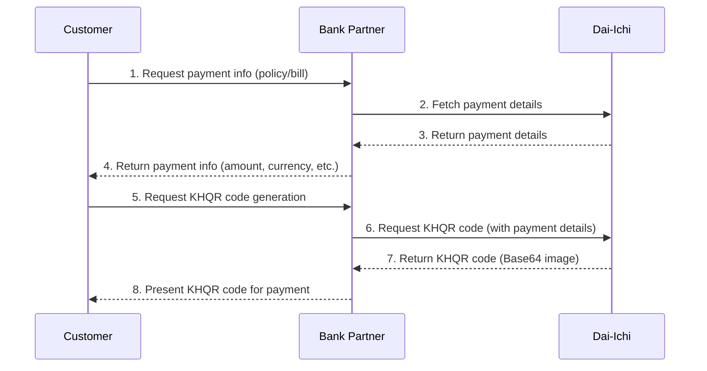
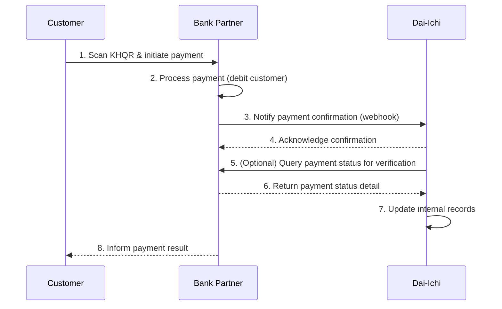

# KHQR API High-Level Flow: QR Generation & Payment Confirmation

**Version:** 1.0  
**Date:** October 7, 2025  
**Scope:** KHQR Payment Integration – Dai-Ichi, Bank Partner, Customer

---

## Participants
- **Customer**: End-user initiating payment
- **Bank Partner**: Bank providing KHQR payment infrastructure
- **Dai-Ichi**: Insurance provider integrating KHQR payments

---

## 1. KHQR Code Generation Flow

---

## 2. KHQR Payment Confirmation Flow

---

## Flow Summary
- **QR Generation**: Customer requests payment info, receives KHQR code via Bank Partner, generated by Dai-Ichi.
- **Payment Confirmation**: Customer pays by scanning KHQR, Bank Partner processes payment, notifies Dai-Ichi, and both parties verify and update records.

---

**Contact:** Payment Hub Development Team  
**Support:** support@daiichi.com.kh
